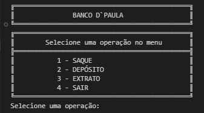
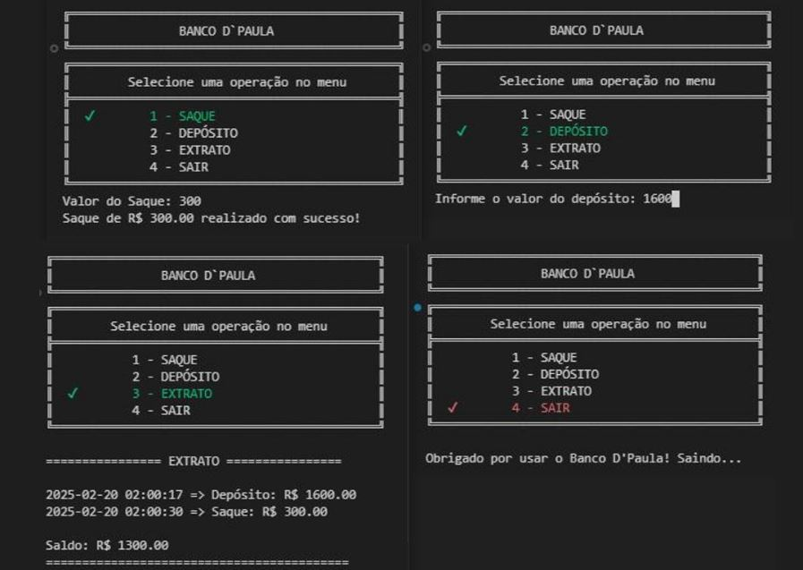
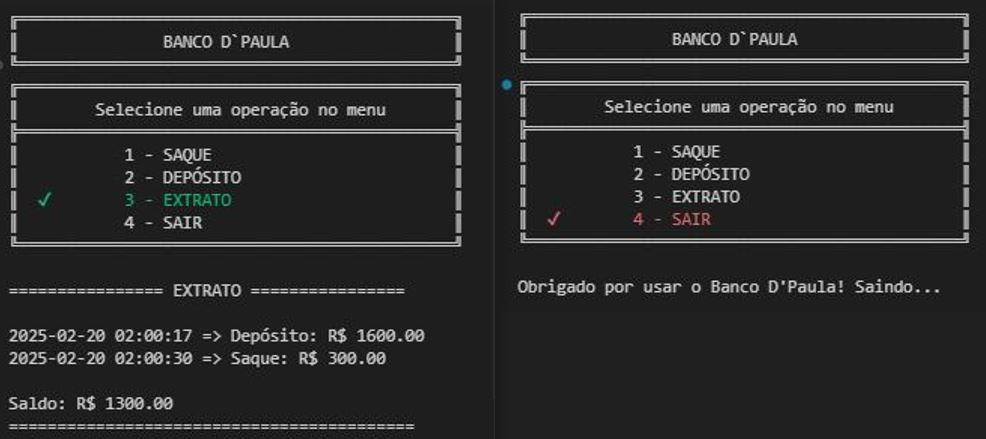

# Sistema Bancário Simples

Este projeto implementa um **Sistema Bancário Simples** com funcionalidades básicas, incluindo **saque**, **depósito** e **extrato**.

## 📌 Funcionalidades

- Realizar **saques** dentro de um limite estabelecido.
- Efetuar **depósitos** na conta.
- Exibir um **extrato detalhado** das transações, incluindo data e hora.
- Interface interativa via terminal com **menu dinâmico**, destacando a opção selecionada.

## 📷 Demonstração

### 📌 Interface do Menu


### 📌 Seleção de Opções


<!--  -->

## 🛠️ Tecnologias Utilizadas

- **Python** (versão 3.x)
- **Colorama** para destacar opções do menu
- **Os** para limpar a tela no terminal
- **Datetime** para registrar data e hora das transações

## 🏦 Estrutura do Código

### 🔹 Classe `ContaBancaria`

A classe `ContaBancaria` gerencia as operações bancárias, incluindo saque, depósito e extrato.

```python
class ContaBancaria:
    def __init__(self, saldo=0.0, limite=500.0, limite_saques=3):
        self.saldo = saldo
        self.limite = limite
        self.limite_saques = limite_saques
        self.numero_saques = 0
        self.extrato = []
```

### 🔹 Menu Dinâmico

O menu exibe as opções de forma interativa e destaca a opção selecionada.

```python
def exibir_menu(opcao_selecionada=None):
    print(f'║ {(Fore.GREEN if opcao_selecionada == "1" else "")}1 - SAQUE{Style.RESET_ALL} │')
    print(f'║ {(Fore.GREEN if opcao_selecionada == "2" else "")}2 - DEPÓSITO{Style.RESET_ALL} │')
    print(f'║ {(Fore.GREEN if opcao_selecionada == "3" else "")}3 - EXTRATO{Style.RESET_ALL} │')
    print(f'║ {(Fore.RED if opcao_selecionada == "4" else "")}4 - SAIR{Style.RESET_ALL} │')
```

## 📌 Melhorias Futuras

- Implementação de **múltiplas contas**.
- Armazenamento das transações em um **banco de dados**.
- Interface gráfica para melhor experiência do usuário.

---
🚀 Desenvolvido por **Alanderson de Paula**


